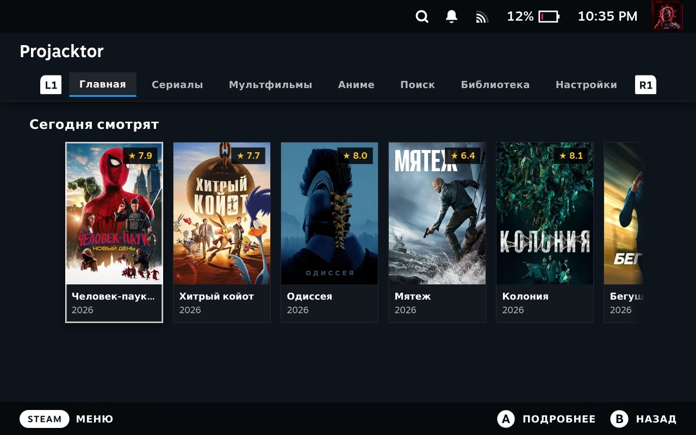

# Projacktor

[🇷🇺 Русский](README.md) | [🇬🇧 English](README.en.md)

A Decky Loader plugin for Steam Deck that transforms the console into a full-featured media center and cinema styled natively for Steam Big Picture (Gaming Mode). Features a movie & TV show catalog, JacRed torrent search, background downloading via built-in Aria2c, online streaming, and an OLED power-saving Magic Black mode.



## 📋 Features

- **Native Steam Big Picture Interface**: Crafted specifically for SteamOS with full optimization for Steam Deck resolution and controls.
- **One Screen = One Shelf**: Clean and responsive vertical navigation between sections ("Watching Today", "Trending Today", "Top Rated") without cluttering the screen.
- **Comprehensive Catalog**: Dedicated tabs for Movies, TV Shows, Cartoons, and Anime with full metadata (posters, descriptions, ratings, release years).
- **Torrent Search via JacRed**: Integrated aggregator search across trusted trackers with quality, size, and seed filtering.
- **Built-in Download Manager (Aria2c)**: High-speed multithreaded downloads directly to internal SSD or MicroSD storage.
- **Online Streaming**: Stream movies and TV episodes immediately without waiting for full download completion.
- **Integrated Video Player**: Fullscreen player with seeking, pause/resume, audio track selection, and smooth playback.
- **MagicBlack (OLED Screen-Off Mode)**: Download movies and series with display turned off (moon icon 🌙 on torrent cards and library). Fills the screen with pure `#000000` black to turn off OLED pixels, saving battery and preventing burn-in, while preventing idle sleep. Wake up instantly by pressing any button or touching the screen.
- **Local Library**: Manage downloaded media, resume playback, and free up space directly from the UI.

---

## 🎮 Gamepad Controls (Steam Deck)

Optimized for physical controller inputs without requiring touchscreen or trackpads:

- **L1 / R1**: Instant tab cycling across all tabs (`Movies ⇄ TV ⇄ Cartoons ⇄ Anime ⇄ Search ⇄ Library ⇄ Settings ⇄ Movies`).
- **D-pad ↓ / ↑**: Vertical shelf navigation ("Watching Today" ⇄ "Trending Today" ⇄ "Top Rated").
- **D-pad ← / →**: Horizontal card browsing with automatic smooth centering on the focused item.
- **A Button (OK)**: Open movie/show details modal, torrent list, and episodes.
- **B Button (Back)**: Close modal / Go back.

---

## 📥 Installation

1. Copy the plugin folder to the Decky Loader plugins directory:
   ```bash
   /home/deck/homebrew/plugins/Projacktor
   ```
2. Make bundled binaries executable:
   ```bash
   chmod +x /home/deck/homebrew/plugins/Projacktor/bin/*
   ```
3. Restart Decky Loader service:
   ```bash
   sudo systemctl restart plugin_loader.service
   ```

---

## ⚖️ License & Credits

- Author: [rosakodu](https://github.com/rosakodu)
- License: MIT
